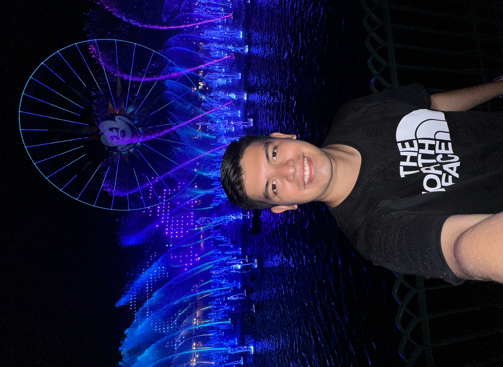
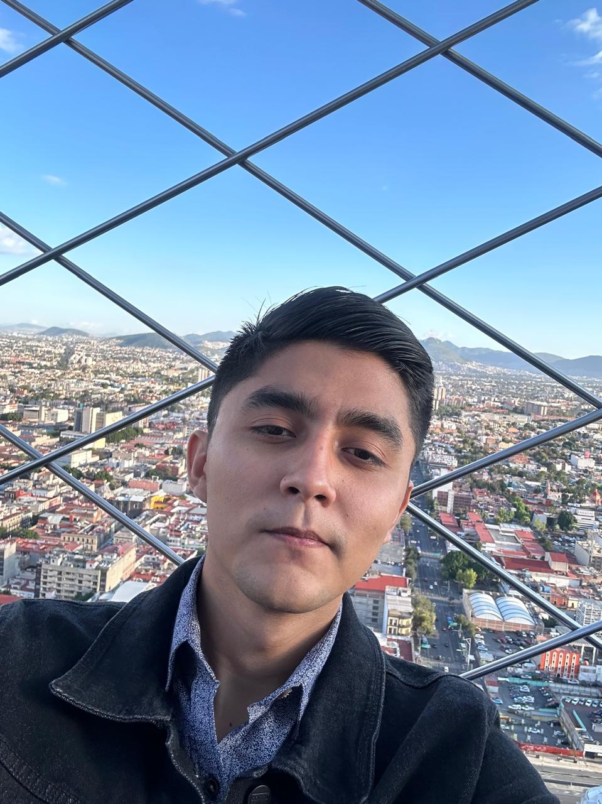

# Búsqueda y Recuperación Web
Repositorio para el proyecto de la asignatura Búsqueda y Recuperación de Información en la Web.

## Integrantes

| Nombre                        | <!-- -->                                                           |
| ----------------------------- | ------------------------------------------------------------------ |
| Fernando Joachín Prieto       |        |
| José Carlos Leo Fernández     |            |
| Elías Madera de Regil         |          |
| Vicente Nava Montoya          |     |
| Fernando Villajuana Saavedra  |     |
